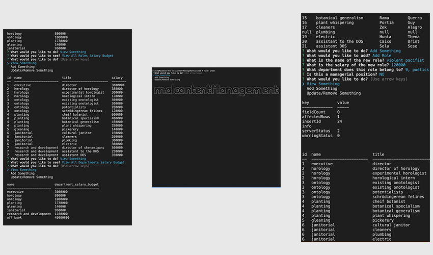

# malcontentManagementSystem 1.0
  

  

  ## OVERVIEW:
   A command line interface to display a sql database containing company departments, roles and employees. This allows a manager to keep track of the organization, to both see and update the structure of the departments, roles, and employees.By using a prompt interface, it reduces the amount of errors possible in displaying and updating records. 

  ## Table Of Contents:
  [Installation](README.md#installation) 
  [Usage](README.md#usage) 
  [Tests](README.md#tests) 
  [Credits](README.md#credits) 
  [Questions](README.md#questions) 
  [License](README.md#license) 

  ## Installation
  This runs with inquirer, mysql2, console.table and figlet (for the ascii art at the initial page), plus all dependencies which should all be installed before running. It runs on a mysql server - the database, schema and seeds are all in the db folder.

  ## Usage
  Once installed, 'node index' will start the program from the command line. Up and down arrows will lead you through the prompts except for when new values, such as names, titles, salaries, etc. need to be entered by keyboard.

  ## Tests
  no custom tests were made for this program, but i've tried to update error logs where possible.

  ## Credits
  Many thanks to the creators of inquirer, mysql, console.table, and figle, as well as the community of creators that make all of these programs possible.

  ## Questions
  [Becket, Codeclast](becketbowes@gmail.com)
  [Github Page](http://www.github.com/becketbowes)

  ## License
  [Creative Commons Attribution License, Sun Mar 13 2022 01:36:27 GMT-0500 (Eastern Standard Time)](https://creativecommons.org/licenses/by/4.0/legalcode)
